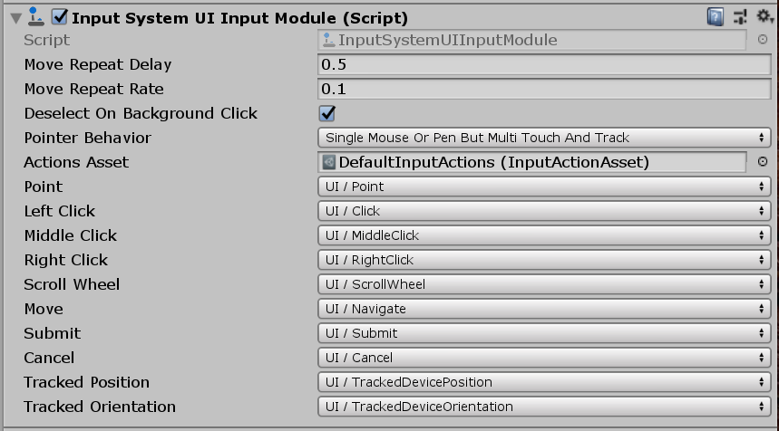
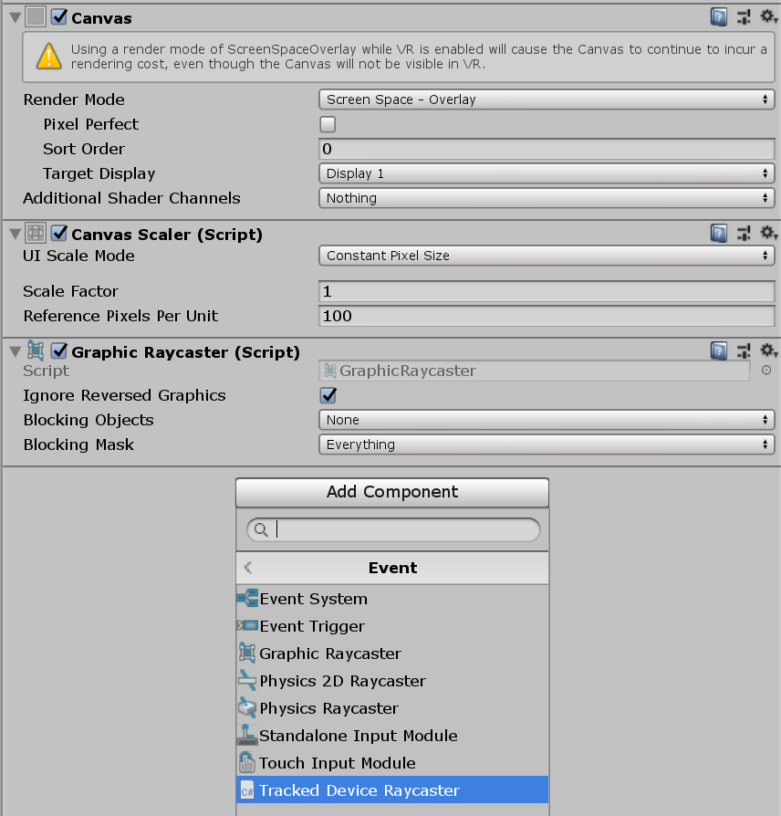

# UI support

You can use the Input System package to control any in-game UI created with the [Unity UI package](https://docs.unity3d.com/Manual/UISystem.html). The integration between the Input System and the UI system is handled by the [`InputSystemUIInputModule`](../api/UnityEngine.InputSystem.UI.InputSystemUIInputModule.html) component.

>NOTE: The Input System package does not currently support IMGUI or UIElements.

## `InputSystemUIInputModule` Component

The [`InputSystemUIInputModule`](../api/UnityEngine.InputSystem.UI.InputSystemUIInputModule.html) component acts as a drop-in replacement for the [`StandaloneInputModule`](https://docs.unity3d.com/Manual/script-StandaloneInputModule.html) component that the Unity UI package. [`InputSystemUIInputModule`](../api/UnityEngine.InputSystem.UI.InputSystemUIInputModule.html) provides the same functionality as  [`StandaloneInputModule`](https://docs.unity3d.com/Manual/script-StandaloneInputModule.html), but it uses the Input System instead of the legacy Input Manager to drive UI input.

If you have a [`StandaloneInputModule`](https://docs.unity3d.com/Manual/script-StandaloneInputModule.html) component on a GameObject, and the Input System is installed, Unity shows a button in the Inspector offering to automatically replace it with a [`InputSystemUIInputModule`](../api/UnityEngine.InputSystem.UI.InputSystemUIInputModule.html) for you. The [`InputSystemUIInputModule`](../api/UnityEngine.InputSystem.UI.InputSystemUIInputModule.html) is pre-configured to use default Input Actions to drive the UI, but you can override that configuration to suit your needs.

You can use the following properties to configure [`InputSystemUIInputModule`](../api/UnityEngine.InputSystem.UI.InputSystemUIInputModule.html):

|Property|Description|
|--------|-----------|
|[`Move Repeat Delay`](../api/UnityEngine.InputSystem.UI.InputSystemUIInputModule.html#UnityEngine_InputSystem_UI_InputSystemUIInputModule_moveRepeatDelay)|The initial delay (in seconds) between generating an initial [`IMoveHandler.OnMove`](https://docs.unity3d.com/Packages/com.unity.ugui@1.0/api/UnityEngine.EventSystems.IMoveHandler.html) navigation event and generating repeated navigation events when the __Move__ Action stays actuated.|
|[`Move Repeat Rate`](../api/UnityEngine.InputSystem.UI.InputSystemUIInputModule.html#UnityEngine_InputSystem_UI_InputSystemUIInputModule_moveRepeatDelay)|The interval (in seconds) between generating repeat navigation events when the __Move__ Action stays actuated. Note that this is capped by the frame rate; there will not be more than one move repeat event each frame so if the frame rate dips below the repeat rate, the effective repeat rate will be lower than this setting.|
|[`Actions Asset`](../api/UnityEngine.InputSystem.UI.InputSystemUIInputModule.html#UnityEngine_InputSystem_UI_InputSystemUIInputModule_actionsAsset)|An [`Input Action Asset`](ActionAssets.md) containing all the Actions to control the UI. You can choose which Actions in the Asset correspond to which UI inputs using the following properties.  By default, this references a built-in Asset named *DefaultInputActions*, which contains common default Actions for driving UI. If you want to set up your own Actions, [create a custom Input Action Asset](ActionAssets.md#creating-input-action-assets) and assign it here. When you assign a new Asset reference to this field in the Inspector, the Editor attempts to automatically map Actions to UI inputs based on common naming conventions.|
|[`Deselect on Background Click`](../api/UnityEngine.InputSystem.UI.InputSystemUIInputModule.html#UnityEngine_InputSystem_UI_InputSystemUIInputModule_deselectOnBackgroundClick)|By default, when the pointer is clicked and does not hit any `GameObject`, the current selection is cleared. This, however, can get in the way of keyboard and gamepad navigation which will want to work off the currently selected object. To prevent automatic deselection, set this property to false.|
|[`Pointer Behavior`](../api/UnityEngine.InputSystem.UI.InputSystemUIInputModule.html#UnityEngine_InputSystem_UI_InputSystemUIInputModule_pointerBehavior)|How to deal with multiple pointers feeding input into the UI. See [pointer-type input](#pointer-type input).|

You can use the following properties to map Actions from the chosen [__Actions Asset__](../api/UnityEngine.InputSystem.UI.InputSystemUIInputModule.html#UnityEngine_InputSystem_UI_InputSystemUIInputModule_actionsAsset) to UI input Actions. In the Inspector, these appear as foldout lists that contain all the Actions in the Asset:

|Property|Description|
|--------|-----------|
|[`Point`](../api/UnityEngine.InputSystem.UI.InputSystemUIInputModule.html#UnityEngine_InputSystem_UI_InputSystemUIInputModule_point)|An Action that delivers a 2D screen position. Use as a cursor for pointing at UI elements to implement mouse-style UI interactions. See [pointer-type input](#pointer-type-input).|
|[`Left Click`](../api/UnityEngine.InputSystem.UI.InputSystemUIInputModule.html#UnityEngine_InputSystem_UI_InputSystemUIInputModule_leftClick)|An Action that maps to the primary cursor button used to interact with UI. See [pointer-type input](#pointer-type-input).|
|[`Middle Click`](../api/UnityEngine.InputSystem.UI.InputSystemUIInputModule.html#UnityEngine_InputSystem_UI_InputSystemUIInputModule_middleClick)|An Action that maps to the middle cursor button used to interact with UI. See [pointer-type input](#pointer-type-input).|
|[`Right Click`](../api/UnityEngine.InputSystem.UI.InputSystemUIInputModule.html#UnityEngine_InputSystem_UI_InputSystemUIInputModule_rightClick)|An Action that maps to the secondary cursor button used to interact with UI. See [pointer-type input](#pointer-type-input).|
|[`Scroll Wheel`](../api/UnityEngine.InputSystem.UI.InputSystemUIInputModule.html#UnityEngine_InputSystem_UI_InputSystemUIInputModule_scrollWheel)|An Action that delivers gesture input to allow scrolling in the UI. See [pointer-type input](#pointer-type-input).|
|[`Move`](../api/UnityEngine.InputSystem.UI.InputSystemUIInputModule.html#UnityEngine_InputSystem_UI_InputSystemUIInputModule_move)|An Action that delivers a 2D vector used to select the currently active UI [selectable](https://docs.unity3d.com/Manual/script-Selectable.html). This allows a gamepad or arrow-key style navigation of the UI. See [navigation-type input](#navigation-type-input).|
|[`Submit`](../api/UnityEngine.InputSystem.UI.InputSystemUIInputModule.html#UnityEngine_InputSystem_UI_InputSystemUIInputModule_submit)|An Action to engage with or "click" the currently selected UI [selectable](https://docs.unity3d.com/Manual/script-Selectable.html). See [navigation-type input](#navigation-type-input).|
|[`Cancel`](../api/UnityEngine.InputSystem.UI.InputSystemUIInputModule.html#UnityEngine_InputSystem_UI_InputSystemUIInputModule_cancel)|An Action to exit any interaction with the currently selected UI [selectable](https://docs.unity3d.com/Manual/script-Selectable.html). See [navigation-type input](#navigation-type-input).|
|[`Tracked Device Position`](../api/UnityEngine.InputSystem.UI.InputSystemUIInputModule.html#UnityEngine_InputSystem_UI_InputSystemUIInputModule_trackedDevicePosition)|An Action that delivers a 3D position of one or multiple spatial tracking devices, such as XR hand controllers. In combination with [`Tracked Device Orientation`](../api/UnityEngine.InputSystem.UI.InputSystemUIInputModule.html#UnityEngine_InputSystem_UI_InputSystemUIInputModule_trackedDeviceOrientation), this allows XR-style UI interactions by pointing at UI [selectables](https://docs.unity3d.com/Manual/script-Selectable.html) in space. See [tracked-type input](#tracked-type-input).|
|[`Tracked Device Orientation`](../api/UnityEngine.InputSystem.UI.InputSystemUIInputModule.html#UnityEngine_InputSystem_UI_InputSystemUIInputModule_trackedDeviceOrientation)|An Action that delivers a `Quaternion` representing the rotation of one or multiple spatial tracking devices, such as XR hand controllers. In combination with [`Tracked Device Position`](../api/UnityEngine.InputSystem.UI.InputSystemUIInputModule.html#UnityEngine_InputSystem_UI_InputSystemUIInputModule_trackedDevicePosition), this allows XR-style UI interactions by pointing at UI [selectables](https://docs.unity3d.com/Manual/script-Selectable.html) in space. See [tracked-type input](#tracked-type-input).|

### How the bindings work

The UI input module can deal with three different types of input:

1) pointer-type input,
2) navigation-type input, and
3) tracked-type input.

For each of these types of input, input is sourced and combined from a specific set of Actions as detailed below.

#### Pointer-type input

To the UI, a pointer is a position from which clicks and scrolls can be triggered to interact with UI elements at the pointer's position. Pointer-type input is sourced from [`point`](../api/UnityEngine.InputSystem.UI.InputSystemUIInputModule.html#UnityEngine_InputSystem_UI_InputSystemUIInputModule_point), [`leftClick`](../api/UnityEngine.InputSystem.UI.InputSystemUIInputModule.html#UnityEngine_InputSystem_UI_InputSystemUIInputModule_leftClick), [`rightClick`](../api/UnityEngine.InputSystem.UI.InputSystemUIInputModule.html#UnityEngine_InputSystem_UI_InputSystemUIInputModule_rightClick), [`middleClick`](../api/UnityEngine.InputSystem.UI.InputSystemUIInputModule.html#UnityEngine_InputSystem_UI_InputSystemUIInputModule_middleClick), and [`scrollWheel`](../api/UnityEngine.InputSystem.UI.InputSystemUIInputModule.html#UnityEngine_InputSystem_UI_InputSystemUIInputModule_scrollWheel).

>NOTE: The UI input module does not have an association between pointers and cursors. In general, the UI is oblivious to whether a cursor exists for a particular pointer. However, for mouse and pen input, the UI input module will respect [`Cusor.lockState`](https://docs.unity3d.com/ScriptReference/Cursor-lockState.html) and pin the pointer position at `(-1,-1)` whenever the cursor is locked.

Multiple pointer devices may feed input into a single UI input module. Also, in the case of [`Touchscreen`](../api/UnityEngine.InputSystem.Touchscreen.html), a single device can have the ability to have multiple concurrent pointers (each finger contact is one pointer).

From the perspective of [`InputSystemUIInputModule`](../api/UnityEngine.InputSystem.UI.InputSystemUIInputModule.html), each [`InputDevice`](../api/UnityEngine.InputSystem.InputDevice.html) that has one or more controls bound to one of the pointer-type actions is considered a unique pointer. Also, for each [`Touchscreen`](../api/UnityEngine.InputSystem.Touchscreen.html) devices, each separate [`TouchControl`](../api/UnityEngine.InputSystem.Controls.TouchControl.html) that has one or more of its controls bound to the those actions is considered its own unique pointer as well. Each pointer receives a unique [`pointerId`](https://docs.unity3d.com/Packages/com.unity.ugui@1.0/api/UnityEngine.EventSystems.PointerEventData.html#UnityEngine_EventSystems_PointerEventData_pointerId) which generally corresponds to the [`deviceId`](../api/UnityEngine.InputSystem.InputDevice.html#UnityEngine_InputSystem_InputDevice_deviceId) of the pointer. However, for touch, this will be a combination of [`deviceId`](../api/UnityEngine.InputSystem.InputDevice.html#UnityEngine_InputSystem_InputDevice_deviceId) and [`touchId`](../api/UnityEngine.InputSystem.Controls.TouchControl.html#UnityEngine_InputSystem_Controls_TouchControl_touchId). Use [`ExtendedPointerEventData.touchId`](../api/UnityEngine.InputSystem.UI.ExtendedPointerEventData.html#UnityEngine_InputSystem_UI_ExtendedPointerEventData_touchId) to find the ID for a touch event.

You can influence how the input module deals with concurrent input from multiple pointers using the [`Pointer Behavior`](../api/UnityEngine.InputSystem.UI.InputSystemUIInputModule.html#UnityEngine_InputSystem_UI_InputSystemUIInputModule_pointerBehavior) setting.

|`Pointer Behavior`|Description|
|------------------|-----------|
|[`Single Mouse or Pen But Multi Touch And Track`](../api/UnityEngine.InputSystem.UI.UIPointerBehavior.html#UnityEngine_InputSystem_UI_UIPointerBehavior_SingleMouseOrPenButMultiTouchAndTrack)|Behaves like [`Single Unified Pointer`](../api/UnityEngine.InputSystem.UI.UIPointerBehavior.html#UnityEngine_InputSystem_UI_UIPointerBehavior_SingleUnifiedPointer) for all input that is not classified as touch or tracked input, and behaves like [`All Pointers As Is`](../api/UnityEngine.InputSystem.UI.UIPointerBehavior.html#UnityEngine_InputSystem_UI_UIPointerBehavior_AllPointersAsIs) for tracked and touch input.  If concurrent input is received on a [`Mouse`](../api/UnityEngine.InputSystem.Mouse.html) and [`Pen`](../api/UnityEngine.InputSystem.Pen.html), for example, the input of both is fed into the same UI pointer instance. The position input of one will overwrite the position of the other.  Note that when input is received from touch or tracked devices, the single unified pointer for mice and pens is __removed__ including [`IPointerExit`](https://docs.unity3d.com/Packages/com.unity.ugui@1.0/api/UnityEngine.EventSystems.IPointerExitHandler.html) events being sent in case the mouse/pen cursor is currently hovering over objects.  This is the default behavior.|
|[`Single Unified Pointer`](../api/UnityEngine.InputSystem.UI.UIPointerBehavior.html#UnityEngine_InputSystem_UI_UIPointerBehavior_SingleUnifiedPointer)|All pointer input is unified such that there is only ever a single pointer. This includes touch and tracked input. This means, for example, that regardless how many devices feed input into [`Point`](../api/UnityEngine.InputSystem.UI.InputSystemUIInputModule.html#UnityEngine_InputSystem_UI_InputSystemUIInputModule_point), only the last such input in a frame will take effect and become the current UI pointer's position.|
|[`All Pointers As Is`](../api/UnityEngine.InputSystem.UI.UIPointerBehavior.html#UnityEngine_InputSystem_UI_UIPointerBehavior_AllPointersAsIs)|The UI input module will not unify any pointer input. Any device, including touch and tracked devices that feed input pointer-type actions, will be its own pointer (or multiple pointers for touch input).  Note: This might mean that there will be an arbitrary number of pointers in the UI, and several objects might be pointed at concurrently.|

>NOTE: If you bind a device to a pointer-type action such as [`Left Click`](../api/UnityEngine.InputSystem.UI.InputSystemUIInputModule.html#UnityEngine_InputSystem_UI_InputSystemUIInputModule_leftClick) without also binding it to [`Point`](../api/UnityEngine.InputSystem.UI.InputSystemUIInputModule.html#UnityEngine_InputSystem_UI_InputSystemUIInputModule_point), the UI input module will recognize the device as not being able to point and try to route its input into that of another pointer. For example, if you bind [`Left Click`](../api/UnityEngine.InputSystem.UI.InputSystemUIInputModule.html#UnityEngine_InputSystem_UI_InputSystemUIInputModule_leftClick) to the `Space` key and [`Point`](../api/UnityEngine.InputSystem.UI.InputSystemUIInputModule.html#UnityEngine_InputSystem_UI_InputSystemUIInputModule_point) to the position of the mouse, then pressing the space bar will result in a left click at the current position of the mouse.

For pointer-type input (as well as for [tracked-type input](#tracked-type input)), [`InputSystemUIInputModule`](../api/UnityEngine.InputSystem.UI.InputSystemUIInputModule.html) will send [`ExtendedPointerEventData`](../api/UnityEngine.InputSystem.UI.ExtendedPointerEventData.html) instances which are an extended version of the base `PointerEventData`. These events contain additional data such as the [device](../api/UnityEngine.InputSystem.UI.ExtendedPointerEventData.html#UnityEngine_InputSystem_UI_ExtendedPointerEventData_device) and [pointer type](../api/UnityEngine.InputSystem.UI.ExtendedPointerEventData.html#UnityEngine_InputSystem_UI_ExtendedPointerEventData_pointerType) which the event has been generated from.

#### Navigation-type input

Navigation-type input controls the current selection based on motion read from the [`move`](../api/UnityEngine.InputSystem.UI.InputSystemUIInputModule.html#UnityEngine_InputSystem_UI_InputSystemUIInputModule_move) action. Additionally, input from
[`submit`](../api/UnityEngine.InputSystem.UI.InputSystemUIInputModule.html#UnityEngine_InputSystem_UI_InputSystemUIInputModule_submit) will trigger `ISubmitHandler` on the currently selected object and
[`Cancel`](../api/UnityEngine.InputSystem.UI.InputSystemUIInputModule.html#UnityEngine_InputSystem_UI_InputSystemUIInputModule_cancel) will trigger `ICancelHandler` on it.

Inputs received on these actions are independent of each other. Thus, an arbitrary set of devices can be bound to these actions and feed input in arbitrary order.

Navigation input is non-positional, that is, unlike with pointer-type input, there is no screen position associcated with these actions. Rather, navigation actions always operate on the current selection.

#### Tracked-type input

Input from [tracked devices](../api/UnityEngine.InputSystem.TrackedDevice.html) such as [XR controllers](../api/UnityEngine.InputSystem.XR.XRController.html) and [HMDs](../api/UnityEngine.InputSystem.XR.XRHMD.html) essentially behaves like [pointer-type input](#pointer-type-input). The main difference is that the world-space device position and orientation sourced from  [`trackedDevicePosition`](../api/UnityEngine.InputSystem.UI.InputSystemUIInputModule.html#UnityEngine_InputSystem_UI_InputSystemUIInputModule_trackedDevicePosition) and  [`trackedDeviceOrientation`](../api/UnityEngine.InputSystem.UI.InputSystemUIInputModule.html#UnityEngine_InputSystem_UI_InputSystemUIInputModule_trackedDeviceOrientation) is translated into a screen-space position via raycasting.

For this raycasting to work, you need to add [`TrackedDeviceRaycaster`](../api/UnityEngine.InputSystem.UI.TrackedDeviceRaycaster.html) to the `GameObject` that has the UI's `Canvas` component. This `GameObject` will usually have a `GraphicRaycaster` component which, however, only works for 2D screen-space raycasting. You can put [`TrackedDeviceRaycaster`](../api/UnityEngine.InputSystem.UI.TrackedDeviceRaycaster.html) alongside `GraphicRaycaster` and both can be enabled at the same time without advserse effect.

Clicks on tracked devices do not differ from other [pointer-type input](#pointer-type-input). Therefore, actions such as [`Left Click`](../api/UnityEngine.InputSystem.UI.InputSystemUIInputModule.html#UnityEngine_InputSystem_UI_InputSystemUIInputModule_leftClick) work for tracked devices just like they work for other pointers.

## `MultiplayerEventSystem` Component

The Input System can also handle multiple separate UI instances on the screen controlled separately from different input Bindings. This is useful if you want to have multiple local players share a single screen with different controllers, so that every player can control their own UI instance. To allow this, you need to replace the [`EventSystem`](https://docs.unity3d.com/Manual/script-EventSystem.html) component from Unity with the Input System's [`MultiplayerEventSystem`](../api/UnityEngine.InputSystem.UI.MultiplayerEventSystem.html) component.

Unlike the [`EventSystem`](https://docs.unity3d.com/Manual/script-EventSystem.html) component, you can have multiple [`MultiplayerEventSystems`](../api/UnityEngine.InputSystem.UI.MultiplayerEventSystem.html) active in the Scene at the same time. That way, you can have multiple players, each with their own [`InputSystemUIInputModule`](../api/UnityEngine.InputSystem.UI.InputSystemUIInputModule.html) and [`MultiplayerEventSystem`](../api/UnityEngine.InputSystem.UI.MultiplayerEventSystem.html) components, and each player can have their own set of Actions driving their own UI instance. If you are using the [`PlayerInput`](Components.md#playerinput-component) component, you can also set up [`PlayerInput`](Components.md#playerinput-component) to automatically configure the player's [`InputSystemUIInputModule`](../api/UnityEngine.InputSystem.UI.InputSystemUIInputModule.html) to use the player's Actions. See the documentation on [`PlayerInput`](Components.md#ui-input) to learn how.

The properties of the [`MultiplayerEventSystem`](../api/UnityEngine.InputSystem.UI.MultiplayerEventSystem.html) component are identical with those from the [Event System](https://docs.unity3d.com/Manual/script-EventSystem.html). Additionally, the [`MultiplayerEventSystem`](../api/UnityEngine.InputSystem.UI.MultiplayerEventSystem.html) component adds a [`playerRoot`](../api/UnityEngine.InputSystem.UI.MultiplayerEventSystem.html#UnityEngine_InputSystem_UI_MultiplayerEventSystem_playerRoot) property, which you can set to a GameObject that contains all the UI [selectables](https://docs.unity3d.com/Manual/script-Selectable.html) this event system should handle in its hierarchy. Mouse input that this event system processes then ignores any UI selectables which are not on any GameObject in the Hierarchy under  [`Player Root`](../api/UnityEngine.InputSystem.UI.MultiplayerEventSystem.html#UnityEngine_InputSystem_UI_MultiplayerEventSystem_playerRoot).
